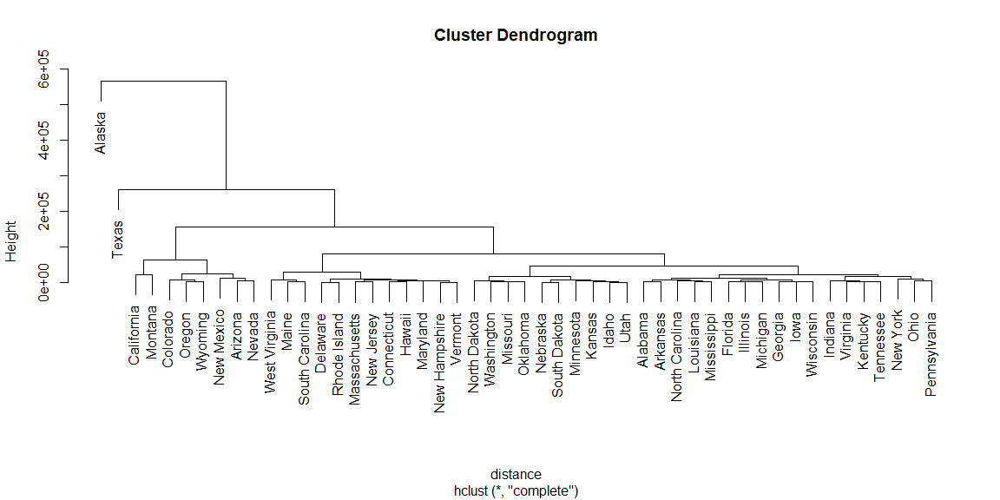
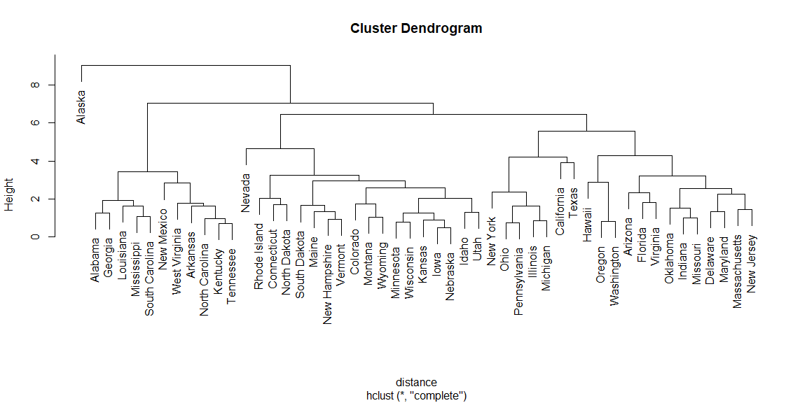
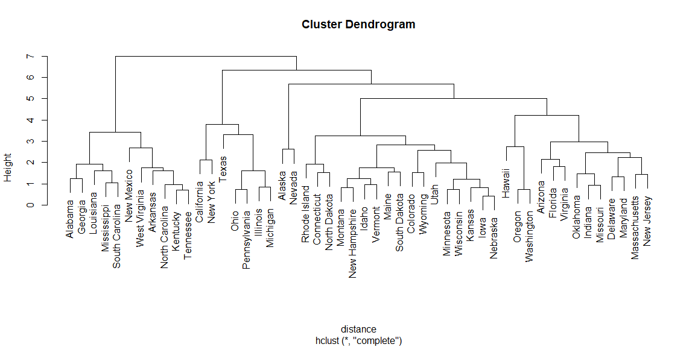
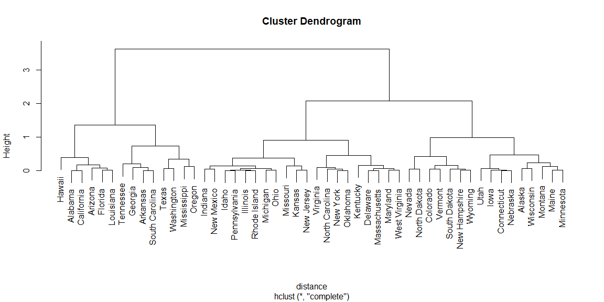
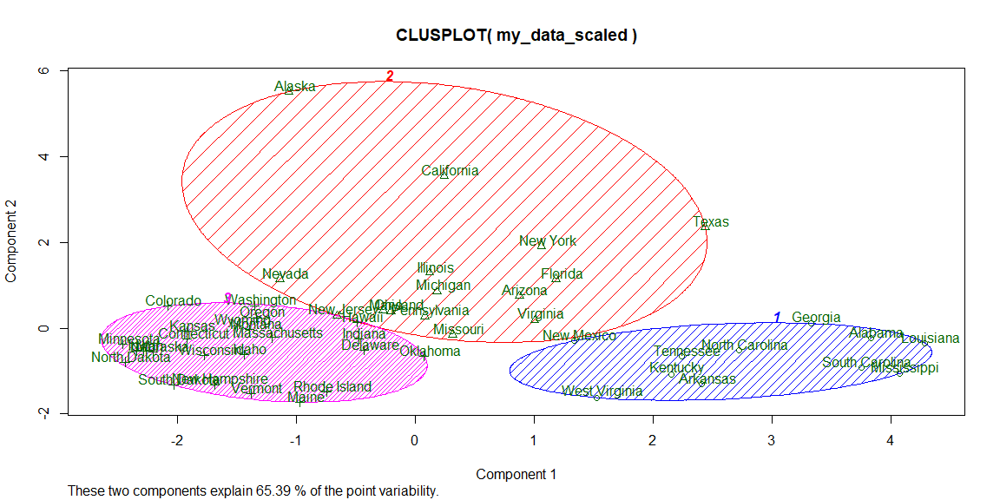
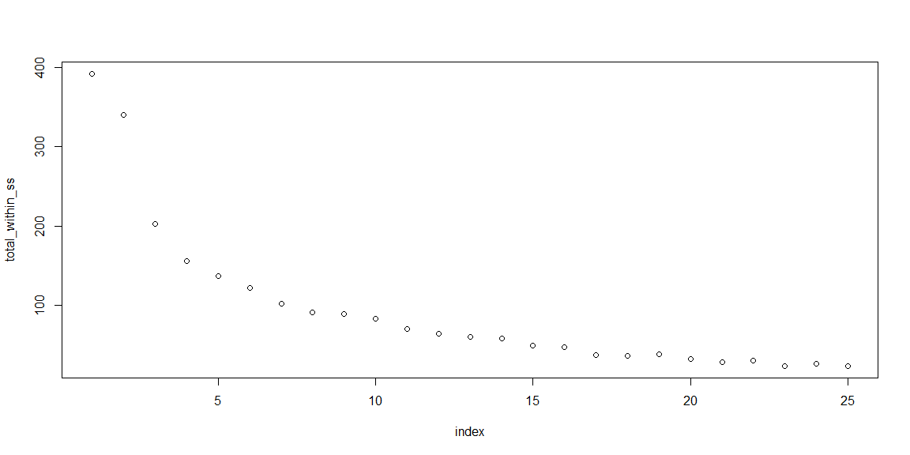
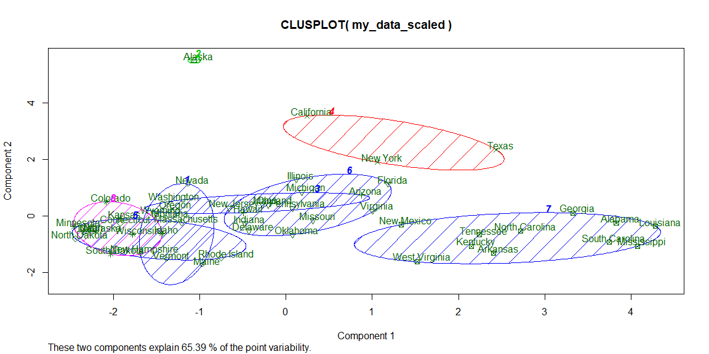

# AGGLOMERATIVE HIERARCHICAL CLUSTERING

### 1. Load the dataset


```r
my_data <- state.x77
```

### 2. Use hierarchical clustering to cluster the data on all attributes and produce a dendrogram


```r
# computing a distance matrix
distance <- dist(as.matrix(my_data))

# perform the clustering
hc <- hclust(distance)

# plot the dendrogram
plot(hc)
```

<!-- -->

### 3. Repeat the previous item with a normalized dataset and note any differences


```r
# normalizing the data
my_data_scaled <- scale(my_data)

# computing a distance matrix
distance <- dist(as.matrix(my_data_scaled))

# perform the clustering
hc <- hclust(distance)

# plot the dendrogram
plot(hc)
```

<!-- -->

California is now with Texas. Alaska is still on its own.

### 4. Remove "Area" from the attributes and re-cluster (and note any differences)


```r
# dropping area column
no_area <- my_data_scaled[ ,-8]

# computing a distance matrix
distance <- dist(as.matrix(no_area))

# perform the clustering
hc <- hclust(distance)

# plot the dendrogram
plot(hc)
```

<!-- -->

Alaska is now grouped with Nevada. California and Texas are no longer together. 

### 5. Cluster only on the Frost attribute and observe the results


```r
# grabbing only frost column
frost_only <- my_data_scaled[ ,7]

# computing a distance matrix
distance <- dist(as.matrix(frost_only))

# perform the clustering
hc <- hclust(distance)

# plot the dendrogram
plot(hc)
```

<!-- -->

The warmer states are closer together or more closely related. Alaska is more grouped with the Eastern states


# K MEANS

### 1. Make sure to use a normalized version of the dataset.


```r
my_data_scaled <- scale(my_data)
```

### 2. Using k-means, cluster the data into 3 clusters. Note the size of each cluster and the mean values. Do you have any insight into why they were divided this way?


```r
# cluster into k=3 clusters:
my_clusters <- kmeans(my_data_scaled, 3)

# size of each cluster
my_clusters$size
```

```
## [1] 11 15 24
```

```r
# Centers (mean values) of the clusters
my_clusters$centers
```

```
##   Population     Income   Illiteracy   Life Exp     Murder    HS Grad
## 1 -0.2269956 -1.3014617  1.391527063 -1.1773136  1.0919809 -1.4157826
## 2  0.9462026  0.7416690  0.005468667 -0.3242467  0.5676042  0.1558335
## 3 -0.4873370  0.1329601 -0.641201154  0.7422562 -0.8552439  0.5515044
##        Frost       Area
## 1 -0.7206500 -0.2340290
## 2 -0.1960979  0.4483198
## 3  0.4528591 -0.1729366
```

```r
# Cluster assignments
my_clusters$cluster
```

```
##        Alabama         Alaska        Arizona       Arkansas     California 
##              1              2              2              1              2 
##       Colorado    Connecticut       Delaware        Florida        Georgia 
##              3              3              3              2              1 
##         Hawaii          Idaho       Illinois        Indiana           Iowa 
##              3              3              2              3              3 
##         Kansas       Kentucky      Louisiana          Maine       Maryland 
##              3              1              1              3              2 
##  Massachusetts       Michigan      Minnesota    Mississippi       Missouri 
##              3              2              3              1              2 
##        Montana       Nebraska         Nevada  New Hampshire     New Jersey 
##              3              3              2              3              2 
##     New Mexico       New York North Carolina   North Dakota           Ohio 
##              1              2              1              3              2 
##       Oklahoma         Oregon   Pennsylvania   Rhode Island South Carolina 
##              3              3              2              3              1 
##   South Dakota      Tennessee          Texas           Utah        Vermont 
##              3              1              2              3              3 
##       Virginia     Washington  West Virginia      Wisconsin        Wyoming 
##              2              3              1              3              3
```

```r
clusplot(my_data_scaled, 
         my_clusters$cluster, 
         color = TRUE, 
         shade = TRUE, 
         labels = 2, 
         lines = 0)
```

<!-- -->

I think area and population have a lot to do with it, but other than that, I am not sure why it clustered those three groups together. 

### 3. Using a for loop, repeat the clustering process for k = 1 to 25, and plot the total within-cluster sum of squares error for each k-value.


```r
index <- 1:25
total_within_ss <- NULL
for (i in index) {
  my_clusters <- kmeans(my_data_scaled, i)
  total_within_ss[i] <- my_clusters$tot.withinss
}

plot(index, total_within_ss)
```

<!-- -->


### 4. Evaluate the plot from the previous item, and choose an appropriate k-value using the "elbow method" mentioned in your reading. Then re-cluster a single time using that k-value. Use this clustering for the remaining questions.


```r
total_within_ss[-1] - total_within_ss[-25]
```

```
##  [1]  -51.3395992 -137.6411888  -46.7528577  -18.7946994  -15.4495848
##  [6]  -19.6146070  -11.4806264   -1.4212333   -6.4888587  -12.6112332
## [11]   -5.9325675   -4.0380622   -1.8586715   -8.7830928   -2.3942705
## [16]   -9.6236909   -0.8642668    1.7458427   -5.8895549   -4.3421678
## [21]    2.0663033   -6.6066787    2.3901005   -2.3733643
```

```r
# I am going to chose k=8
my_clusters <- kmeans(my_data_scaled, 8)

my_clusters$withinss
```

```
## [1] 13.246549  0.000000  9.568064 11.349042  5.858717 22.920067 23.622274
## [8]  8.534971
```

```r
my_clusters$tot.withinss
```

```
## [1] 95.09968
```

### 5. List the states in each cluster.


```r
my_clusters$cluster
```

```
##        Alabama         Alaska        Arizona       Arkansas     California 
##              7              2              3              7              4 
##       Colorado    Connecticut       Delaware        Florida        Georgia 
##              8              5              6              6              7 
##         Hawaii          Idaho       Illinois        Indiana           Iowa 
##              3              8              6              6              8 
##         Kansas       Kentucky      Louisiana          Maine       Maryland 
##              8              7              7              1              6 
##  Massachusetts       Michigan      Minnesota    Mississippi       Missouri 
##              5              6              8              7              6 
##        Montana       Nebraska         Nevada  New Hampshire     New Jersey 
##              1              8              1              1              6 
##     New Mexico       New York North Carolina   North Dakota           Ohio 
##              7              4              7              5              6 
##       Oklahoma         Oregon   Pennsylvania   Rhode Island South Carolina 
##              6              3              6              5              7 
##   South Dakota      Tennessee          Texas           Utah        Vermont 
##              8              7              4              8              1 
##       Virginia     Washington  West Virginia      Wisconsin        Wyoming 
##              6              3              7              8              1
```

### 6. Use "clusplot" to plot a 2D representation of the clustering.


```r
clusplot(my_data_scaled, 
         my_clusters$cluster, 
         color = TRUE, 
         shade = TRUE, 
         labels = 2, 
         lines = 0)
```

<!-- -->

### 7. Analyze the centers of each of these clusters. Can you identify any insight into this clustering?


```r
# Centers (mean values) of the clusters
my_clusters$centers
```

```
##   Population      Income Illiteracy   Life Exp     Murder     HS Grad
## 1 -0.7998119 -0.18194543 -0.9077986 -0.2646516 -0.4229491  0.78519273
## 2 -0.8693980  3.05824562  0.5413980 -1.1685098  1.0624293  1.68280347
## 3 -0.4514893  0.51825155  0.0902330  0.8353735 -0.4748696  0.96161967
## 4  2.8948232  0.48692374  0.6507713  0.1301655  1.0172810  0.13932569
## 5 -0.3641893  0.81566236 -0.1558570  1.0197457 -1.3078554 -0.03813298
## 6  0.5605894  0.43321891 -0.3062453 -0.2224385  0.2091268 -0.15884615
## 7 -0.2269956 -1.30146170  1.3915271 -1.1773136  1.0919809 -1.41578257
## 8 -0.4426230  0.03938354 -0.9351420  1.1739064 -0.9963322  0.77487537
##         Frost         Area
## 1  1.25764268 -0.043991939
## 2  0.91456761  5.809349671
## 3 -1.57192510 -0.001018197
## 4 -1.13105760  0.992720037
## 5  0.65966604 -0.585784154
## 6 -0.03930935 -0.354699455
## 7 -0.72065003 -0.234028991
## 8  0.77562755  0.072707068
```

Most of the centers are below zero in the Population column, and many centers are above zero in the HS Grad column. 


I think my work here meets requirements. I was able to do what was asked of me, but I didn't expend much effort to go beyond that, other than for my own understanding. 
